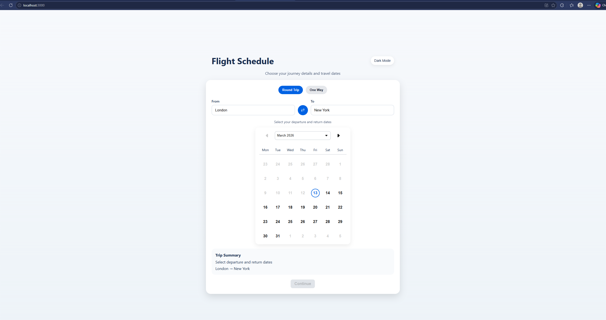

# Skyscanner Flight Schedule Calendar

This project was built as part of the **Skyscanner Software Engineering Virtual Experience** on Forage.

The task was to build a flight schedule interface using React and the Skyscanner Backpack design system. The application allows users to select travel dates using a calendar component and continue with their flight search.

---

## Features

- Flight schedule calendar
- Date selection using Backpack calendar component
- Continue button interaction
- Airport input fields (From / To)
- Trip summary display
- Responsive UI

---

## Technologies Used

- React
- JavaScript
- CSS
- Skyscanner Backpack Design System
- date-fns
- Node.js
- npm
- Git 
- Github

---

## Versions Used

During development, the following versions were used to avoid compatibility issues:

| Tool | Version |
|-----|--------|
| Node.js | 16.20.2 |
| npm | 8.19.4 |
| React | 18.3.1 |
| React DOM | 18.3.1 |
| Backpack Web | latest compatible version |
| date-fns | latest |
| Sass | latest |

If you encounter installation issues, make sure your Node.js and npm versions are compatible with the packages above.

## Screenshot



---

## Installation

Clone the repository:

```bash
git clone https://github.com/HarikaPokalakari/skyscanner-flight-schedule-calendar.git
